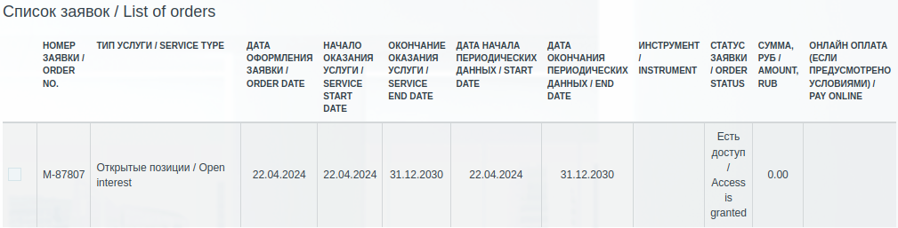

# Как получить доступ к данным MOEX ALGOPACK?

## Шаг 1
Переходим на [страницу](https://passport.moex.com) и регистрируемся.

Логин и пароль необходимо запомнить — это ваши данные для авторизации, необходимые при использовании библиотеки. 🧐

После регистрации у вас должен появиться доступ к [SuperCandles](https://moexalgo.github.io/modules/supercandles/): https://iss.moex.com/iss/datashop/algopack/eq/tradestats/sber.

## Шаг 2
Чтобы получить доступ к расширенному функционалу algopack (свечи, стакан заявок, FUTOI), необходимо перейти на [страницу](https://www.moex.com/ru/analyticalproducts?futoi) и оформить подписку на продукт "Открытые позиции / Open interest". Пока продукт в разработке, подписка бесплатна, но она необходима для доступа к полному функционалу AlgoPack.

Подтверждение заявки займет некоторое время, обычно в течение дня. 😊 

Чтобы убедиться, что доступ выдан, в списке заявок напротив продукта ```Открытые позиции / Open interest``` статус должен быть ```Есть доступ / Access is granted```.



Супер! Работоспособность вашей подписки вы можете проверить, посетив роут: https://iss.moex.com/iss/engines/stock/markets/shares/boards/tqbr/securities/sber/orderbook — если данные есть, значит, вы сделали все правильно! 🎉


### Шаг 3
Теперь вы готовы покорять рынок инвестиций вместе с AlgoPack! Перед началом работы ознакомьтесь с [quick start python библиотеки](https://github.com/moexalgo/moexalgo/blob/main/samples/quick_start.ipynb) или с примером, [как авторизировать запросы к ISS](https://github.com/moexalgo/moexalgo/blob/main/samples/auth.ipynb). 🚀

